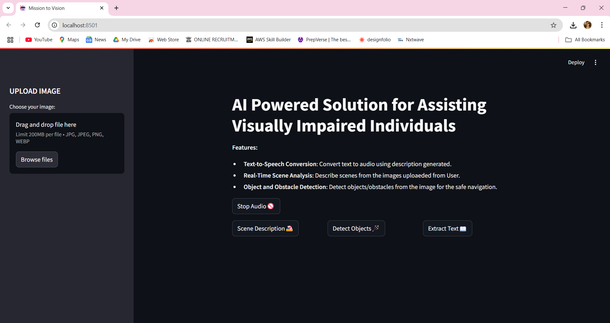
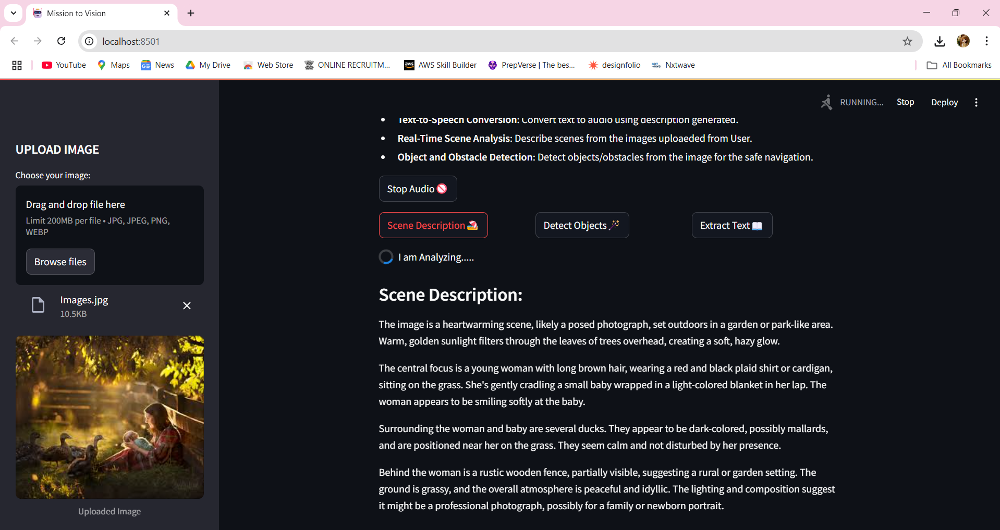
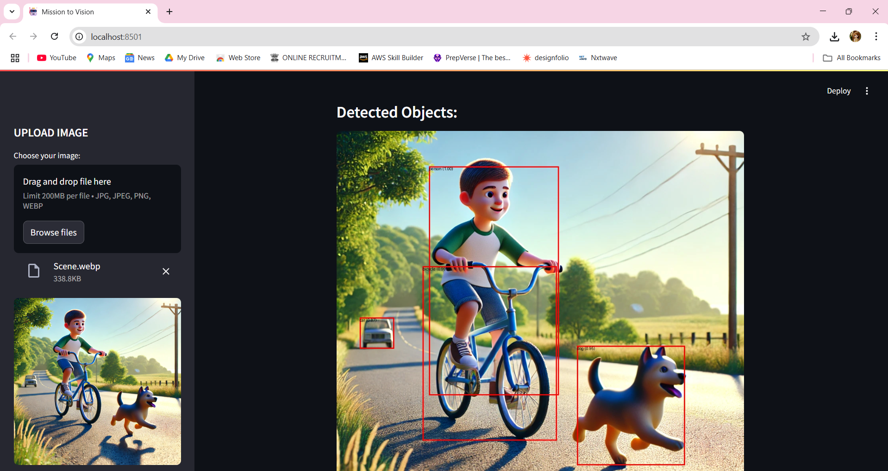
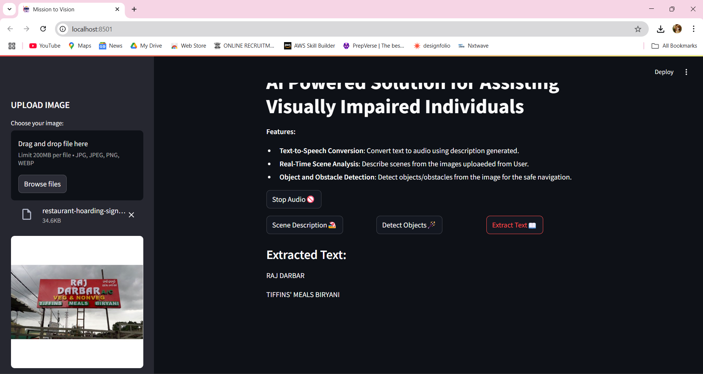

<!DOCTYPE html>
<html lang="en">
<head>
  <meta charset="UTF-8">
</head>
<body style="font-family:Arial, sans-serif; line-height:1.6; color:#333; padding:20px; max-width:850px; margin:auto;">

  <h1>👁️ Vision AI: Assisting the Visually Impaired Indiviuals Using AI</h1>

  <h2>📘 Project Overview</h2>
  

    Vision AI is an AI-powered application designed to assist visually impaired individuals by transforming images into descriptive audio outputs. It integrates <strong>scene description</strong>, <strong>object detection</strong>, and <strong>OCR-based text extraction</strong> with <strong>text-to-speech</strong> to enhance environmental awareness and accessibility.
  

  <h2>🎯 Objectives</h2>
  <ul>
    <li>To build an intelligent system that describes scenes and detects objects from images.</li>
    <li>To extract and vocalize text from images for enhanced readability.</li>
    <li>To provide a seamless and intuitive web interface using <strong>Streamlit</strong>.</li>
  </ul>

  <h2>🧠 Key Features</h2>
  <ul>
    <li>🌆 <strong>Scene Analysis:</strong> Uses Google's Gemini Generative AI for contextual scene descriptions.</li>
    <li>📦 <strong>Object Detection:</strong> Uses Faster R-CNN to highlight and label objects with bounding boxes.</li>
    <li>📝 <strong>Text Extraction:</strong> Tesseract OCR extracts text from images.</li>
    <li>🔊 <strong>Speech Feedback:</strong> Converts extracted or generated text into audio using Pyttsx3.</li>
    <li>🎛️ <strong>Audio Control:</strong> Includes functionality to stop audio playback.</li>
  </ul>

  <h2>⚙️ Technologies Used</h2>
  <ul>
    <li><strong>Language:</strong> Python 3.12</li>
    <li><strong>Libraries:</strong> Streamlit, Tesseract OCR, Pyttsx3, Torch, Torchvision</li>
    <li><strong>AI Model:</strong> Google Gemini for scene description</li>
    <li><strong>Others:</strong> PIL for image processing, dotenv for configuration</li>
  </ul>

  <h2>📋 Functional Workflow</h2>
  <ol>
    <li>User uploads an image through the interface.</li>
    <li>The app generates a scene description using Generative AI.</li>
    <li>Objects in the image are detected and labeled visually.</li>
    <li>Text is extracted and read aloud using text-to-speech.</li>
    <li>Users can stop audio playback as needed.</li>
  </ol>

  <h2>✅ Advantages</h2>
  <ul>
    <li>Unified interface for scene understanding, reading, and detection.</li>
    <li>Accessible design tailored for visually impaired users.</li>
    <li>Works effectively on various types of images (text, objects, scenes).</li>
  </ul>

  <h2>📈 Future Scope</h2>
  <ul>
    <li>📹 Real-time video analysis support for live scene understanding.</li>
    <li>📱 Edge device compatibility (mobile, IoT).</li>
    <li>🗣️ Multilingual speech support.</li>
    <li>🎙️ Voice customization for better user experience.</li>
  </ul>

  <h2>🧪 Step-by-Step Implementation</h2>
  <ol>
    <li>Run the app with: <code>streamlit run app.py</code></li>
    <li>Upload an image and click on “Scene Description”.</li>
    <li>Upload another image and click on “Detect Objects”.</li>
    <li>Upload another image and click on “Extract Text”.</li>
  </ol>

  <h2>💡 Applications</h2>
  <ul>
    <li>Helping visually impaired users understand surroundings.</li>
    <li>Reading printed or handwritten text via audio output.</li>
    <li>Object identification and awareness in new environments.</li>
  </ul>

  <h2>📷 Screenshots (Add yours here)</h2>
  <ul>
    <li>Main Page of Application</li>
    
    <li>Scene Description Example</li>
    
    <li>Object Detection Output</li>
    
    <li>Extracted Text and Audio Output</li>
    
  </ul>

  <h2>🙌 Conclusion</h2>
  

    Vision AI successfully demonstrates the practical application of AI to improve accessibility. Its combination of computer vision, generative AI, and assistive technologies makes it a powerful tool for enhancing independence for visually impaired individuals.
  

</body>
</html>
